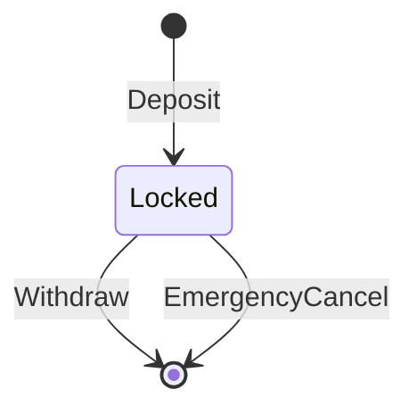

# Protocol Audit Artefact

Generated by AikenFlow from the protocol specification.

Assurance artefacts are generated from AikenFlow IR. They are review and test scaffolds, not formal proofs. Repository outlines and agent-context files are not used as protocol semantics.

## Protocol Summary

- Protocol: `SimpleVault`
- Description: Simple custody workflow with owner authorization and deadline-based withdrawal.
- States: 1
- Transitions: 3
- Invariants: 3

## State Machine

## Assets

| Name | Kind | Policy |
|---|---|---|
| `ada` | `lovelace` | _n/a_ |

## Datum Schemas

### Locked

| Field | Type |
|---|---|
| `owner` | `PubKeyHash` |
| `amount` | `Lovelace` |
| `deadline` | `POSIXTime` |

## Redeemer Schemas

- `Locked` accepts `Withdraw`, `EmergencyCancel`

## Transition Table

| Transition | Consumes | References | Produces | Constraints |
|---|---|---|---|---|
| `Deposit` | _none_ | _none_ | `Locked` | `signed_by($owner)`, `positive($amount)` |
| `Withdraw` | `Locked` | _none_ | _none_ | `signed_by(datum.owner)`, `after(datum.deadline)` |
| `EmergencyCancel` | `Locked` | _none_ | _none_ | `signed_by(datum.owner)`, `before(datum.deadline)` |

## Constraint Coverage

| Transition | Constraint | Generated Negative Case | Compiler Coverage |
|---|---|---|---|
| `Deposit` | `signed_by($owner)` | `missing_signature` | off-chain signer parameter and test scaffold; no generated validator branch |
| `Deposit` | `positive($amount)` | `non_positive_value` | test scaffold and manual review only; no generated validator branch |
| `Withdraw` | `signed_by(datum.owner)` | `missing_signature` | generated validator check and test scaffold |
| `Withdraw` | `after(datum.deadline)` | `premature_validity_interval` | generated validator check and test scaffold |
| `EmergencyCancel` | `signed_by(datum.owner)` | `missing_signature` | generated validator check and test scaffold |
| `EmergencyCancel` | `before(datum.deadline)` | `expired_validity_interval` | generated validator check and test scaffold |

## Invariants

These invariants are **not formally proven** by AikenFlow. They are review targets with generated test scaffolding where matching transitions can be identified.

| Invariant | Expression | Formal Status | Generated Test Coverage |
|---|---|---|---|
| `no_negative_locked_value` | `locked.amount >= 0` | not formally proven | _not mapped_ |
| `withdrawal_requires_owner` | `transition.Withdraw requires signature(datum.owner)` | not formally proven | partial; 2 generated negative case(s) |
| `withdrawal_requires_deadline_passed` | `transition.Withdraw requires after(datum.deadline)` | not formally proven | partial; 2 generated negative case(s) |

## Threat Model

- Missing required signatures.
- Premature or expired validity intervals.
- Mutated datum fields across state transitions.
- Missing required outputs after consuming state UTxOs.
- Asset conservation failures or incorrect mint/burn amounts.

## Generated Adversarial Cases

- `Deposit`: 2 case(s)
- `Withdraw`: 2 case(s)
- `EmergencyCancel`: 2 case(s)

## Assumptions

- Generated validators are readable scaffolds and must be reviewed before production deployment.
- Generated TypeScript builders expose topology and require integration with a concrete Lucid/Yaci setup.
- The MVP supports script spending, simple outputs, signatures, validity windows, and mint/burn summaries.

## Known Limitations

- No formal proof backend is included.
- Multi-validator protocol coordination is represented but not fully verified.
- Custom Aiken constraints are preserved as code snippets only when they are valid expressions.
- Cost profiling requires running `aiken build` and local transaction evaluation outside this crate.

## Cost Profile

_Not measured. Run Aiken and local emulator tooling after generation._
