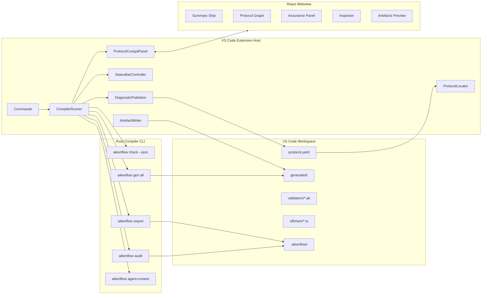

# AikenFlow VS Code Extension Architecture

Status: production frontend direction  
Audience: AikenFlow maintainers, extension contributors, compiler contributors  
Last updated: 2026-04-28

Implementation status:

- `extensions/vscode-aikenflow` exists.
- The extension host runs real `aikenflow` CLI commands by subprocess.
- The React webview renders exported bundles.
- Diagnostics mapping is implemented for diagnostics that include real source
  ranges; current Rust bundles do not yet emit source ranges.
- Webview selections can jump back to `protocol.yaml` source locations using a
  navigation-only YAML locator.
- Generated artefact previews can open generated files near the currently
  selected protocol symbol when a matching line is found.
- Unit tests cover diagnostics JSON parsing and generated-manifest conflict
  detection, source navigation, and artefact line navigation.

## 1. Product Decision

AikenFlow should ship as a VS Code extension backed by the Rust compiler/CLI.

The product is:

```text
AikenFlow for VS Code
Protocol assurance workbench for Aiken/Cardano builders
```

It is not:

```text
standalone Cardano IDE
no-code smart contract builder
replacement for the Aiken language extension
dashboard disconnected from real workspace files
```

The key product choice:

```text
Do not build a new IDE.
Embed the AikenFlow protocol cockpit inside the IDE developers already use.
```

## 2. Core Boundary

The architecture has three layers:

```text
Rust backend / CLI = semantic authority
VS Code extension host = orchestration and editor integration
React webview = visual protocol cockpit
```

Strict rules:

- Rust owns protocol parsing, IR, diagnostics, graph generation, invariant status, artefacts, and audit output.
- The VS Code extension calls Rust and publishes results into VS Code.
- The webview renders compiler-produced bundles and sends user intents back to the extension.
- TypeScript must not infer protocol semantics from YAML.
- TypeScript must not prove invariants.
- TypeScript must not generate validators or transaction builders.
- Repository-intelligence helpers such as `ast-outline` remain optional agent-support only.

Trusted flow:

```text
protocol.yaml
  -> aikenflow check/export/gen/audit
  -> semantic IR inside Rust
  -> JSON bundle + diagnostics + artefacts
  -> VS Code extension services
  -> React webview rendering
```

## 3. Why VS Code Extension

VS Code already provides:

- editor
- file explorer
- search
- terminal
- git
- settings
- command palette
- keyboard shortcuts
- diagnostics and Problems view
- extension distribution
- workspace trust model

AikenFlow should provide only the domain layer:

- protocol graph
- transaction topology
- assurance panel
- invariant matrix
- risk findings
- generated artefact preview
- audit report navigation
- agent-context generation

This avoids building a parallel IDE while still giving AikenFlow a serious product surface.

## 4. Official VS Code APIs Used

The extension should stay on stable VS Code APIs:

- Commands for user workflows.
- Webviews for the protocol cockpit.
- Diagnostics for `protocol.yaml` warnings/errors.
- Status bar for analysis state and risk summary.
- Workspace/file APIs for reading protocol files and writing generated artefacts.
- Configuration APIs for compiler path and output directories.
- Extension testing APIs for integration tests.

References:

- [VS Code Extension API](https://code.visualstudio.com/api)
- [Extension Guidelines](https://code.visualstudio.com/api/references/extension-guidelines)
- [Webview API](https://code.visualstudio.com/api/extension-guides/webview)
- [Commands](https://code.visualstudio.com/api/extension-guides/command)
- [Extension Manifest](https://code.visualstudio.com/api/references/extension-manifest)
- [VS Code API Reference](https://code.visualstudio.com/api/references/vscode-api)
- [Extension Testing](https://code.visualstudio.com/api/working-with-extensions/testing-extension)

## 5. Target Repository Structure

```text
AikenFlow/
  crates/
    aikenflow-ir/
    aikenflow-parser/
    aikenflow-aiken-gen/
    aikenflow-lucid-gen/
    aikenflow-assurance/
    aikenflow-export/
    aikenflow-agent-support/
    aikenflow-cli/

  extensions/
    vscode-aikenflow/
      package.json
      tsconfig.json
      esbuild.js
      README.md

      src/
        extension.ts
        commands.ts
        configuration.ts
        cli/
          compilerDiscovery.ts
          compilerRunner.ts
          cliTypes.ts
        diagnostics/
          diagnosticPublisher.ts
          diagnosticMapper.ts
        status/
          statusBarController.ts
        artefacts/
          artefactWriter.ts
          generatedManifest.ts
        webview/
          ProtocolCockpitPanel.ts
          webviewHtml.ts
          webviewMessages.ts
          webviewResource.ts
        workspace/
          protocolLocator.ts
          workspacePaths.ts
        test/
          extension.test.ts

      webview-ui/
        package.json
        vite.config.ts
        tsconfig.json
        index.html
        src/
          main.tsx
          App.tsx
          vscodeApi.ts
          messages.ts
          core/
            types.ts
            bundleStore.ts
            selectionStore.ts
            artefactNavigation.ts
          features/
            graph/
            assurance/
            artefacts/
            inspector/
            summary/
          styles/
            globals.css

      fixtures/
        workspaces/
          simple-vault/
          auction-risk/
```

The extension is the production frontend. There is no standalone web app in the
production tree.

## 6. Runtime Architecture



## 7. CLI Integration

The first implementation uses the existing Rust CLI. Do not introduce a daemon in v0.1.

### 7.1 Backend Discovery

Resolution order:

```text
1. vscode setting: aikenflow.backendPath
2. environment variable: AIKENFLOW_BIN
3. legacy vscode setting: aikenflow.compilerPath
4. bundled extension binary, if present for current platform
5. PATH lookup: aikenflow
```

If the binary is missing, commands fail with a clear actionable message:

```text
AikenFlow backend not found.
Install the aikenflow CLI or set aikenflow.backendPath.
```

No command should silently fall back to mock data.

### 7.2 Process Execution

Use `child_process.execFile` or `spawn` without a shell.

Rules:

- never use shell string interpolation
- pass arguments as an array
- set working directory to the workspace root
- enforce a timeout
- support cancellation
- capture stdout/stderr for Output Channel
- parse JSON from files where possible, not mixed stdout logs

### 7.3 Workspace Write Boundaries

All extension-managed output paths are workspace-relative settings:

```text
aikenflow.bundlePath
aikenflow.generatedOutputDir
aikenflow.auditOutputPath
aikenflow.agentContextPath
```

Before any CLI command can write to those locations, the extension must reject:

- absolute paths
- Windows drive absolute paths
- parent traversal segments
- empty or current-directory segments
- NUL bytes

Generated artefact paths from bundle JSON and webview messages are also treated
as untrusted input. They must be validated as safe relative paths before the
extension opens or reveals files on disk.

### 7.4 v0.1 Commands Backed by CLI

```text
AikenFlow: Analyse Protocol
  -> aikenflow export <protocol.yaml> --out .aikenflow/bundle.json
  -> publish diagnostics from bundle/check output
  -> open or refresh cockpit webview

AikenFlow: Generate Artefacts
  -> aikenflow gen all <protocol.yaml> --out generated/
  -> update generated manifest
  -> refresh artefact preview

AikenFlow: Export Audit Report
  -> aikenflow audit <protocol.yaml> --out .aikenflow/AUDIT.md
  -> open markdown preview or webview audit tab

AikenFlow: Create Agent Context
  -> aikenflow agent-context <workspace> --for codex
  -> open .aikenflow/agent-context.md
```

## 8. Extension Commands

Command IDs:

```ts
export const Commands = {
  analyseProtocol: 'aikenflow.analyseProtocol',
  openProtocolCockpit: 'aikenflow.openProtocolCockpit',
  generateArtefacts: 'aikenflow.generateArtefacts',
  exportAuditReport: 'aikenflow.exportAuditReport',
  createAgentContext: 'aikenflow.createAgentContext',
  revealProtocolSource: 'aikenflow.revealProtocolSource',
  revealGeneratedArtefact: 'aikenflow.revealGeneratedArtefact',
} as const;
```

Command Palette labels:

```text
AikenFlow: Analyse Protocol
AikenFlow: Open Protocol Cockpit
AikenFlow: Generate Artefacts
AikenFlow: Export Audit Report
AikenFlow: Create Agent Context
```

Context menu contributions:

```text
protocol.yaml -> AikenFlow: Analyse Protocol
protocol.yaml -> AikenFlow: Open Protocol Cockpit
folder       -> AikenFlow: Create Agent Context
```

## 9. Settings

Required settings:

```json
{
  "aikenflow.backendPath": "",
  "aikenflow.compilerPath": "",
  "aikenflow.protocolSpecPath": "",
  "aikenflow.bundlePath": ".aikenflow/bundle.json",
  "aikenflow.generatedOutputDir": "generated",
  "aikenflow.auditOutputPath": ".aikenflow/AUDIT.md",
  "aikenflow.agentContextPath": ".aikenflow/agent-context.md",
  "aikenflow.autoAnalyseOnSave": false,
  "aikenflow.analysisTimeoutMs": 30000
}
```

Defaults should be conservative. Auto-analysis on save is off until performance is proven on real projects.

## 10. Webview Architecture

The webview is a React app rendered inside VS Code.

It should not contain a full YAML editor. VS Code already owns editing. The webview should show source-linked protocol context and provide buttons that reveal source ranges in the real editor.

Default webview layout:

```text
┌─────────────────────────────────────────────────────────────┐
│ Protocol Summary                                            │
│ name · states · transitions · invariants · warnings · risk  │
├─────────────────────────────────────┬───────────────────────┤
│ Protocol Graph                       │ Assurance             │
│ state/transaction topology           │ coverage/risk/finding │
├─────────────────────────────────────┴───────────────────────┤
│ Generated Artefacts | Audit Preview | Topology JSON          │
└─────────────────────────────────────────────────────────────┘
```

Optional split with the native editor:

```text
VS Code editor group 1: protocol.yaml
VS Code editor group 2: AikenFlow Protocol Cockpit webview
```

This is more idiomatic than embedding Monaco inside the webview.

## 11. Webview Message Protocol

All webview communication must be typed.

```ts
export type ExtensionToWebview =
  | { type: 'bundle.loaded'; bundle: AikenFlowBundle; sourceUri: string }
  | { type: 'analysis.started'; protocolUri: string }
  | { type: 'analysis.completed'; bundle: AikenFlowBundle; elapsedMs: number }
  | { type: 'analysis.failed'; message: string; stderr?: string }
  | { type: 'selection.changed'; selection: ProtocolSelection }
  | { type: 'artefacts.updated'; manifest: GeneratedManifest };

export type WebviewToExtension =
  | { type: 'command.analyse' }
  | { type: 'command.generateArtefacts' }
  | { type: 'command.exportAudit' }
  | { type: 'reveal.source'; target: ProtocolSourceTarget }
  | { type: 'reveal.artefact'; path: string; line?: number }
  | { type: 'selection.changed'; selection: ProtocolSelection };
```

The webview must not read workspace files directly. It asks the extension host to reveal or open files.

## 12. Webview Security

Required security rules:

- Set a restrictive Content Security Policy.
- Use a nonce for scripts.
- Use `webview.asWebviewUri` for local assets.
- Set `localResourceRoots` to the extension media directory and required workspace paths only.
- Do not load remote scripts.
- Do not enable arbitrary HTML from compiler output.
- Sanitize audit markdown before rendering.
- Keep `enableScripts: true` only because the React app requires it.
- Prefer `retainContextWhenHidden: true` only if graph state restoration is expensive; otherwise reload from bundle.

No bundle content should be treated as trusted HTML.

## 13. Diagnostics Integration

Diagnostics appear in:

- VS Code Problems view
- editor squiggles for `protocol.yaml`
- cockpit Assurance panel
- status bar warning/error counts

Diagnostic source:

```text
aikenflow check --json
or
aikenflow export bundle diagnostics
```

Mapping rule:

- If a diagnostic has a source range, publish it to VS Code diagnostics.
- If it has only a protocol target, show it in the cockpit and allow reveal when source mapping exists.
- If it has neither, show it in Output Channel and Assurance summary.
- Do not invent line numbers.

Diagnostic collection:

```ts
vscode.languages.createDiagnosticCollection('aikenflow')
```

## 14. Status Bar

The status bar should show real compiler state.

Examples:

```text
AikenFlow: idle
AikenFlow: analysing...
AikenFlow: medium risk · 4 warnings
AikenFlow: error · open Problems
```

Click behavior:

```text
status bar click -> AikenFlow: Open Protocol Cockpit
```

No animated fake progress. Use VS Code progress notifications while the CLI is running.

## 15. Generated Artefact Policy

Generated files are useful only if writes are safe and inspectable.

Output roots:

```text
.aikenflow/
  bundle.json
  generated-manifest.json
  AUDIT.md
  agent-context.md

generated/
  contracts/
  offchain/
  tests/
  assurance/
```

Write rules:

- Preview artefacts from bundle before writing.
- Write only when the user runs `AikenFlow: Generate Artefacts`.
- Never overwrite user-owned files silently.
- Compare previous hashes from `.aikenflow/generated-manifest.json`.
- Mark conflicts when a generated file was manually edited.
- Open a diff for conflicts.
- Report created, changed, skipped, and conflicted files.

The webview can display generated code, but the extension host performs workspace writes.

## 16. Bundle Contract

The webview consumes the same bundle exported by Rust.

Minimum v0.1:

```ts
export type AikenFlowBundle = {
  schemaVersion: '0.1.0';
  protocol: {
    name: string;
    description?: string;
    sourceYaml: string;
  };
  graph: {
    states: GraphState[];
    transactions: GraphTransaction[];
    edges: GraphEdge[];
    transitions: GraphTransition[];
  };
  diagnostics: Diagnostic[];
  invariants: InvariantStatus[];
  metrics: ProtocolMetrics;
  findings: RiskFinding[];
  artefacts: {
    aiken: GeneratedArtefact[];
    lucid: GeneratedArtefact[];
    tests: GeneratedArtefact[];
    audit: GeneratedArtefact[];
  };
};
```

Future additions should be driven by real navigation needs:

```ts
export type AikenFlowBundleV2 = AikenFlowBundle & {
  sourceMap: SourceMapEntry[];
  symbolMap: SymbolMapEntry[];
  generatedManifest: GeneratedManifest;
  analysisRun: {
    id: string;
    elapsedMs: number;
    compilerVersion: string;
    protocolHash: string;
  };
};
```

The extension should validate bundle schema before sending it to the webview.

## 17. Cockpit UX

The cockpit should make protocol risk visible, not merely show generated code.

Required views:

- Protocol summary strip.
- State/transaction graph.
- Assurance panel.
- Invariant matrix.
- Risk findings.
- Transition/state inspector.
- Generated artefacts preview.
- Audit preview.

Required interactions:

- Click graph state -> inspector shows datum, consumed by, produced by, related warnings.
- Click graph transition -> inspector shows transaction topology, constraints, generated files, tests.
- Click risk finding -> graph highlights affected path and editor reveals YAML range if available.
- Click generated artefact -> VS Code opens generated file or preview.
- Click invariant -> graph highlights covered/partial/missing transitions.

Color semantics:

```text
blue/cyan = selected or active protocol flow
green     = covered / holds
yellow    = partial / manual review
red       = missing / high risk
purple    = generated artefact relation
neutral   = inactive context
```

## 18. Relationship With Aiken Tooling

AikenFlow must be positioned as a companion, not a replacement.

```text
Aiken language extension = Aiken editing, syntax, language support
AikenFlow extension      = protocol structure, risk analysis, generated artefacts, audit context
```

Do not duplicate Aiken language server responsibilities in v0.1.

## 19. Agent Support

Agent support is optional and separate from correctness.

Command:

```text
AikenFlow: Create Agent Context
```

Backed by:

```bash
aikenflow agent-context <workspace> --for codex
```

Output:

```text
.aikenflow/agent-context.md
```

Rules:

- surface `ast-outline` missing/install errors clearly
- open the generated markdown file in VS Code
- label repository-derived protocol drafts as unverified
- never feed repository heuristics back into compiler semantics automatically

## 20. Implementation Plan

### Phase 1: Extension Skeleton With Real CLI

Outcome:

- `extensions/vscode-aikenflow` exists.
- `activate()` registers commands.
- compiler discovery works.
- `AikenFlow: Analyse Protocol` runs real `aikenflow export`.
- missing compiler path produces a clear error.
- Output Channel shows stdout/stderr.

### Phase 2: Webview Cockpit

Outcome:

- React webview loads real bundle from `.aikenflow/bundle.json`.
- graph, assurance, inspector, and artefacts render from bundle.
- no mock protocol data in production command paths.

### Phase 3: Diagnostics

Outcome:

- `aikenflow check --json` or export diagnostics populate VS Code Problems.
- editor markers use real source ranges only.
- status bar displays real warning/error counts.

### Phase 4: Generated Artefacts

Outcome:

- `AikenFlow: Generate Artefacts` runs real `aikenflow gen all`.
- manifest comparison protects user edits.
- generated files can be opened from cockpit.

### Phase 5: Audit and Agent Context

Outcome:

- `AikenFlow: Export Audit Report` writes real audit markdown.
- `AikenFlow: Create Agent Context` writes real Codex context markdown.
- both open in VS Code after generation.

### Phase 6: Release Packaging

Outcome:

- extension builds a VSIX.
- webview assets are bundled.
- README documents CLI requirement and backendPath setting.
- smoke tests pass on a fixture workspace.

## 21. Testing Strategy

### Rust Tests

Existing Rust tests remain mandatory:

```bash
cargo test --workspace --no-fail-fast
cargo clippy --workspace --all-targets -- -D warnings
```

### Extension Unit Tests

Test:

- compiler discovery
- CLI argument construction
- diagnostics mapping
- workspace path resolution
- generated manifest conflict detection
- webview message validation

### Extension Integration Tests

Use `@vscode/test-electron`.

Fixture flow:

```text
copy fixture workspace to a temporary directory
open protocol.yaml
run AikenFlow: Analyse Protocol
assert .aikenflow/bundle.json exists
assert Problems has diagnostics when fixture contains warnings
run AikenFlow: Generate Artefacts
assert generated/.aikenflow-generated.json exists and generated tests do not pass falsely
run AikenFlow: Export Audit Report
assert .aikenflow/AUDIT.md exists
run AikenFlow: Create Agent Context
assert .aikenflow/agent-context.md exists
set aikenflow.backendPath to a missing binary
assert Analyse Protocol fails without writing a bundle
write an invalid protocol.yaml
assert VS Code Problems receives AikenFlow diagnostics with source ranges
```

The fixture source directory must stay clean. It must not contain generated
`.aikenflow`, `.vscode/settings.json`, `generated`, or local absolute paths.

### Webview Tests

Use real exported fixture bundles.

Test:

- summary counts
- graph nodes and transitions
- invariant matrix statuses
- risk finding click message
- generated artefact preview

Do not use hand-written bundles when a Rust export fixture can produce the same data.

## 22. Release Criteria

The VS Code extension v0.1 is complete when:

- It runs against a real AikenFlow CLI.
- It analyses a real `protocol.yaml`.
- It writes a real `.aikenflow/bundle.json`.
- It opens a webview cockpit using that bundle.
- It publishes diagnostics into Problems.
- It shows protocol graph, assurance, inspector, generated artefacts, and audit preview.
- It generates artefacts through the Rust CLI.
- It protects generated file overwrites through a manifest check.
- It exports audit markdown.
- It handles missing CLI, invalid protocol, empty workspace, and CLI failure gracefully.
- It has integration tests for the primary workflow.

## 23. Explicit Non-Goals

Do not build these in v0.1:

- standalone IDE app
- standalone Tauri app
- custom YAML editor inside the cockpit
- Aiken language server replacement
- daemon or LSP process
- live graph editing
- formal proof UI
- auto-fix of protocol semantics
- fake analysis mode
- mock generated artefacts in production commands

## 24. Final Principle

```text
Rust decides what the protocol means.
VS Code keeps the developer in their existing workspace.
The extension orchestrates real compiler commands.
The React webview makes protocol topology and risk visible.
```

AikenFlow should not compete with the developer's IDE. It should add the protocol assurance layer that the existing IDE does not have.
